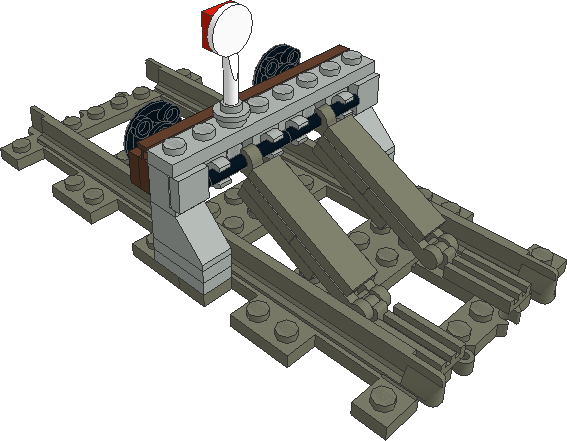
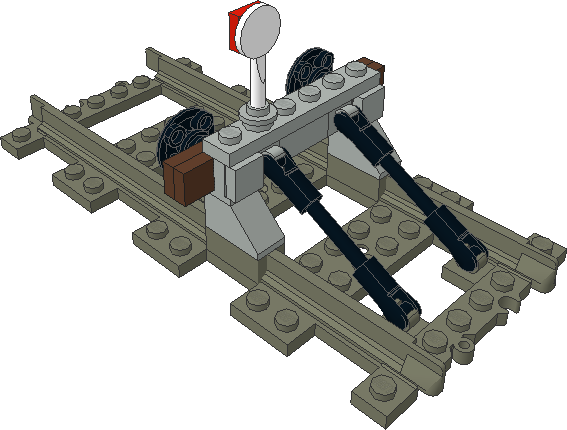
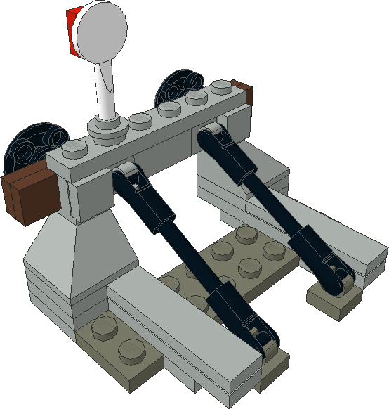
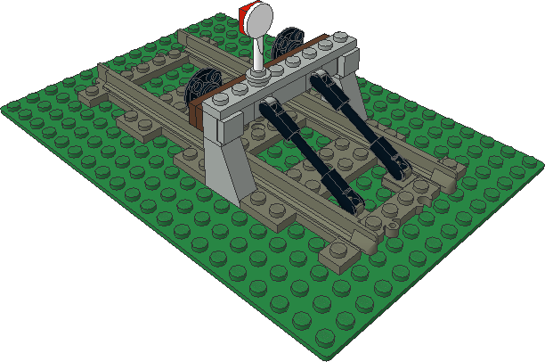

# Prellbock
(For the English version please see below)

Eigenschaften:
* Stabil - hält einen mit Rangiertempo anrollenden Waggon auf.
* Die Geometrie der Streben stimmt exakt.
* Sieht ganz gut aus.
* Gibt bei Überlastung nach - keine beschädigten Teile.
Muss man nach dem Crash halt neu zusammenbauen.

Eine Grundkonstruktion mit Variationsmöglichkeiten.
Und weil das so ist, gibt es mehrere LDraw Dateien.
Die Versionen D und G (meine Favoriten) haben sogar einzelne Bauschritte
bekommen.

Wer vor dem Einsatz eines 3D-Druckers nicht zurückschreckt und die Gleise
modifiziert, kann an der Optik noch einiges "holen".
Variante E zeigt Euch die Idee.

Ob es all die Teile in den passenden Farben gibt, kann ich Euch nicht sagen.
Immerhin habe ich die meisten Schlüsselelemente mit passender Farbe in der
Teilekiste meines Sohnes gefunden.

# Übersicht / Overview

| File                                                | Rendered Picture                           |
|-----------------------------------------------------|--------------------------------------------|
| Prellbock 0 (no file)                               | - soon to come -                           |
| [Prellbock A.ldr](./LDraw%20files/Prellbock_A.ldr)  |  |
| [Prellbock B.ldr](./LDraw%20files/Prellbock_B.ldr)  |  |
| [Prellbock C.ldr](./LDraw%20files/Prellbock_C.ldr)  |  |
| [Prellbock D.ldr](./LDraw%20files/Prellbock_D.ldr)  |  |
| [Prellbock E.ldr](./LDraw%20files/Prellbock_E.ldr)  |  |
| [Prellbock F.ldr](./LDraw%20files/Prellbock_F.ldr)  |  |
| [Prellbock G.ldr](./LDraw%20files/Prellbock_G.ldr)  |  |

# Buffer Stop
(Die deutsche Version steht oben)

Properties:
* Sturdy - stops a car rolling not too fast.
* Provides exactly fitting part geometry.
* Looks nice.
* Full speed crashs do not damage parts.
You just need to reassemble the bricks.

The core construction has some room for variations.
Because of this, there are several LDraw files available.
My favored version D and G already are prepared with step by step instructions.

Who wants to use a 3D printer can improve the look quite a lot.
Variant E gives you an impression.

I have no idea if all the parts are available in the colours given.
At least most of them I found in the part box of my son.